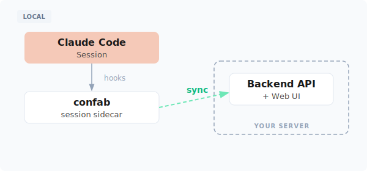

# confab

Sync and explore your Claude Code sessions. Connect `confab` to your Confab backend to capture transcripts in real-time for exploration, sharing, and analysis.

Works seamlessly — your `claude` workflow stays exactly the same.



## Install

Supported on macOS and Linux.

```bash
curl -fsSL https://raw.githubusercontent.com/ConfabulousDev/confab/main/install.sh | bash
# Follow the instructions to add confab to your PATH
confab setup --backend-url https://confab.yourcompany.com
```

After setup, your Claude Code sessions will automatically sync to the configured backend.

## Connect to Your Backend

```bash
# Initial setup — configures backend, authenticates, and installs hooks
confab setup --backend-url https://confab.yourcompany.com

# Login separately (if already set up)
confab login --backend-url https://confab.yourcompany.com

# Check connection and hook status
confab status

# Logout
confab logout
```

## Self-Hosting the Backend

To deploy your own Confab backend, see [confab-web](https://github.com/ConfabulousDev/confab-web).

## Usage

### Sync Mode (Default)

Sessions are synced incrementally while you work:

```bash
# Install sync hooks (done automatically by setup)
confab hooks add

# View running sync daemons
confab sync status

# Remove hooks
confab hooks remove
```

The sync daemon uploads transcript data periodically during your session, so data isn't lost if the session ends unexpectedly.

### List Sessions

```bash
# List all local sessions
confab list

# Filter by duration
confab list -d 5d    # Sessions from last 5 days
confab list -d 12h   # Sessions from last 12 hours
```

Copy a session ID from the list to use with `confab save`.

### Manual Upload

```bash
# Upload specific sessions by ID (use IDs from 'confab list')
confab save abc123de

# Upload multiple sessions
confab save abc123de f9e8d7c6
```

### Redaction

Sensitive data is automatically redacted before uploading. Redaction is enabled by default during `confab setup`.

Built-in patterns detect common secrets (API keys, private keys, JWT tokens, database passwords, and more) without any configuration.

See [Redaction](REDACTION.md) for configuration details.

## Configuration

| File | Purpose |
|------|---------|
| `~/.confab/config.json` | Backend URL, API key, and redaction settings |
| `~/.confab/logs/confab.log` | Operation logs (auto-rotated, 14 day retention) |

## Environment Variables

| Variable | Default | Purpose |
|----------|---------|---------|
| `CONFAB_CLAUDE_DIR` | `~/.claude` | Claude Code state directory |
| `CONFAB_CONFIG_PATH` | `~/.confab/config.json` | Config file location |
| `CONFAB_LOG_DIR` | `~/.confab/logs` | Log directory |

## Development

```bash
make build
go test ./...
```

### Building from Source

```bash
git clone https://github.com/ConfabulousDev/confab.git
cd confab
make build
./confab install
# Follow the instructions to add confab to your PATH
confab setup --backend-url https://confab.yourcompany.com
```

## License

MIT
