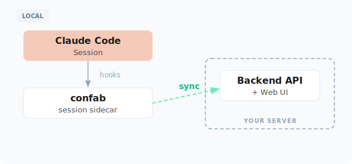

# confab

Sync and explore Claude Code, Codex, and OpenCode sessions. Connect `confab` to your Confab backend to capture transcripts in real time for exploration, sharing, and analysis.

Your `claude`, `codex`, and `opencode` workflows stay unchanged.



## Install

Supported on macOS and Linux.

```bash
curl -fsSL https://raw.githubusercontent.com/ConfabulousDev/confab/main/install.sh | bash
# Follow the instructions to add confab to your PATH
confab setup --backend-url https://confab.yourcompany.com
```

`confab setup` detects provider CLIs (`claude`, `codex`, `opencode`) on `PATH` and wires each one. Claude Code, Codex, and OpenCode sessions sync in the same setup pass.

## Connect to Your Backend

```bash
# Initial setup: backend, auth, hooks, bundled skills
confab setup --backend-url https://confab.yourcompany.com

# Login separately (if already set up)
confab login --backend-url https://confab.yourcompany.com

# Check connection and hook status
confab status

# Logout
confab logout
```

## Self-Hosting the Backend

To deploy your own Confab backend, see [confab-web](https://github.com/ConfabulousDev/confab-web).

## Usage

### Sync Mode (Default)

Sessions are synced incrementally while you work:

```bash
# Install sync hooks (done automatically by setup)
confab hooks add

# View running sync daemons
confab sync status

# Remove hooks
confab hooks remove
```

The sync daemon uploads transcript chunks while you work, reducing data loss if the session exits unexpectedly.

### List Sessions

```bash
# List all local sessions
confab list

# Filter by duration
confab list -d 5d    # Sessions from last 5 days
confab list -d 12h   # Sessions from last 12 hours
```

Use a listed session ID with `confab save`.

### Manual Upload

```bash
# Upload specific sessions by ID (use IDs from 'confab list')
confab save abc123de

# Upload multiple sessions
confab save abc123de f9e8d7c6
```

### Redaction

Sensitive data is automatically redacted before uploading. Redaction is enabled by default during `confab setup`.

Built-in patterns detect common secrets (API keys, private keys, JWT tokens, database passwords, and more) without any configuration.

See [Redaction](REDACTION.md) for configuration details.

## Codex

Confab supports Codex alongside Claude Code. `confab setup` detects `codex` on `PATH` and wires Codex hooks automatically. Use `--provider codex` to configure only Codex.

```bash
# Auto-detect: installs hooks for every provider CLI on PATH
confab setup --backend-url https://confab.yourcompany.com

# Codex-only (explicit override)
confab setup --provider codex --backend-url https://confab.yourcompany.com

# List Codex sessions
confab list --provider codex

# Upload a specific Codex session
confab save --provider codex <id>
```

Codex stores rollouts under `~/.codex/sessions/<yyyy>/<mm>/<dd>/rollout-*.jsonl`. Confab uses Codex's local SQLite state to walk subagent trees and sync descendant rollouts as sidechain files under the root session.

### Caveats

- Bundled skills (`/retro`) install for Claude Code, Codex, and OpenCode.
- GitHub commit/PR linking is wired for Claude Code and Codex. Claude also supports the GitHub MCP PR matcher; Codex uses Bash hooks.
- Codex sync daemons shut down via parent-process liveness, not a `SessionEnd`/`Stop` hook.

## OpenCode

Confab supports OpenCode alongside Claude Code and Codex. `confab setup` detects `opencode` on `PATH` and wires it automatically. Use `--provider opencode` to configure only OpenCode.

```bash
# Auto-detect: wires every provider CLI on PATH
confab setup --backend-url https://confab.yourcompany.com

# OpenCode-only (explicit override)
confab setup --provider opencode --backend-url https://confab.yourcompany.com
```

OpenCode has no on-disk transcript file — session data lives in a local SQLite database (`~/.local/share/opencode/opencode.db`). Confab does not edit OpenCode's config; instead `setup` installs a small TypeScript plugin into `~/.config/opencode/plugins/` that starts and stops the sync daemon on session lifecycle events. The daemon reads the SQLite database, materializes each session into a local transcript file, and uploads it through the same incremental, redacted pipeline as the other providers.

### Caveats

- **Live sync only.** OpenCode sessions are captured while you work. Offline commands (`confab list --provider opencode`, `confab save --provider opencode`) are not supported.
- **No GitHub commit/PR linking.** The bidirectional GitHub linking wired for Claude Code and Codex is not available for OpenCode.
- **Root sessions only.** OpenCode subagent sessions are suppressed; only the user-initiated root session is captured.
- **Plugin-based install.** Lifecycle is driven by the installed plugin (not an OpenCode-native hook system). The daemon also monitors the parent OpenCode process and exits if it dies.
- Bundled skills (`/retro`) install under `~/.config/opencode/skills/`.

## Configuration

| File | Purpose |
|------|---------|
| `~/.confab/config.json` | Backend URL, API key, and redaction settings |
| `~/.confab/logs/confab.log` | Operation logs (auto-rotated, 14 day retention) |

## Environment Variables

| Variable | Default | Purpose |
|----------|---------|---------|
| `CONFAB_CLAUDE_DIR` | `~/.claude` | Override the Claude Code state directory |
| `CONFAB_CODEX_DIR` | `~/.codex` | Override the Codex state directory |
| `CONFAB_OPENCODE_CONFIG_DIR` | `~/.config/opencode` | Override the OpenCode config directory (plugin + skills) |
| `CONFAB_OPENCODE_DB` | `~/.local/share/opencode/opencode.db` | Override the OpenCode SQLite database location |
| `CONFAB_CONFIG_PATH` | `~/.confab/config.json` | Config file location |
| `CONFAB_LOG_DIR` | `~/.confab/logs` | Log directory |

## Developer Docs

Each package has a README with extension guides, invariants, and design decisions:

- [`cmd/`](cmd/README.md) — CLI commands and hook handlers
- [`pkg/`](pkg/README.md) — Package index and dependency map
  - [`config`](pkg/config/README.md), [`daemon`](pkg/daemon/README.md), [`git`](pkg/git/README.md), [`hookconfig`](pkg/hookconfig/README.md), [`http`](pkg/http/README.md), [`logger`](pkg/logger/README.md), [`provider`](pkg/provider/README.md), [`redactor`](pkg/redactor/README.md), [`sync`](pkg/sync/README.md), [`types`](pkg/types/README.md), [`utils`](pkg/utils/README.md)

See also [`CLAUDE.md`](CLAUDE.md) for AI-oriented architecture notes and development practices.

## Development

```bash
make build
go test ./...
```

### Building from Source

```bash
git clone https://github.com/ConfabulousDev/confab.git
cd confab
make build
./confab install
# Follow the instructions to add confab to your PATH
confab setup --backend-url https://confab.yourcompany.com
```

## License

MIT
